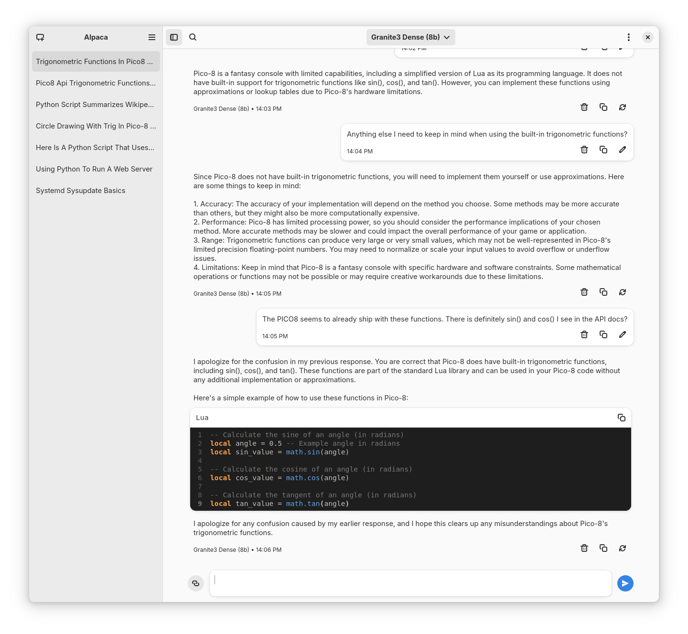

<picture class="full pixels">
    <source srcset="assets/granite-splash.png" media="(prefers-color-scheme: dark)">
    
</picture>

## Supercharge Your Workflow with IBM Granite Model  

**Streamline Your Development Process** 
Harness the power of IBM Granite's cutting-edge AI right from your favorite IDE. Enhance your productivity, write smarter code, and accelerate time-to-market with intelligent, context-aware suggestions. 

### Key Features  
- **AI-Powered Code Completion** 
  Say goodbye to boilerplate code. Granite anticipates your next steps, helping you write cleaner, more efficient code faster. 

- **Error Detection & Fixes** 
  Debugging made effortless. Granite flags issues in real-time and offers tailored solutions, so you can focus on building, not fixing. 

- **Seamless Collaboration** 
  Built for teams, Granite facilitates collaborative coding with shared insights and version history, ensuring everyone is on the same page. 

- **Customizable Workflows** 
  Tailor the integration to fit your unique project needs. Configure suggestions, linting rules, and more to match your style. 

### Supported IDEs  
Granite Integration supports popular IDEs like Visual Studio Code, IntelliJ IDEA, Eclipse, and more. 

**Get Started Now** 
Transform the way you code. Download the IBM Granite IDE extension today and experience the future of development. 

<a href="" class="inline-button">Download</a>
